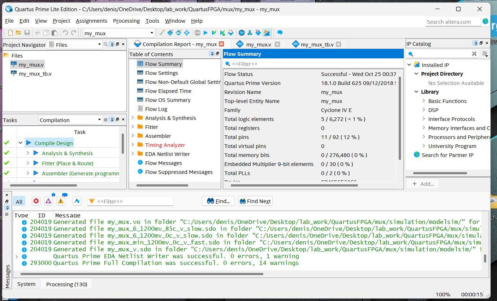
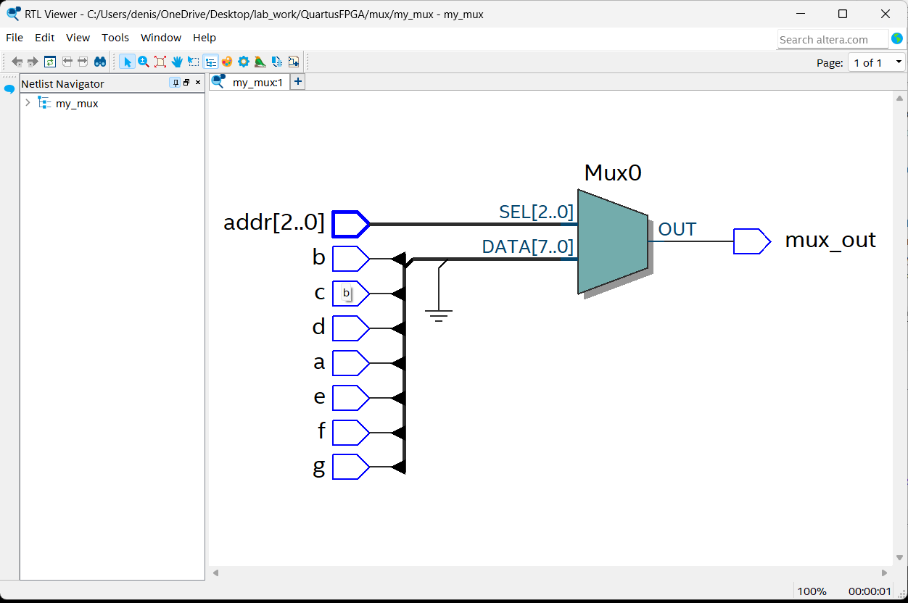
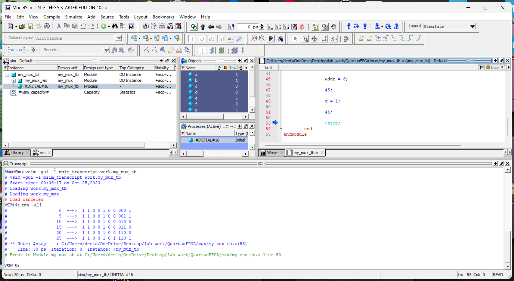

# Мультиплексор
## Синтез

Код для создания мультиплексора с 7-ю входами:

'''verilog

	module my_mux(a, b, c, d, e, f, g, addr, mux_out);
		input a,
			b,
			c,
			d,
			e,
			f,
			g;
				
		input	[2:0] addr;
		
		output mux_out;
		
		wire [6:0] in_vec = {g, f, e, d, c, b, a};

		assign mux_out = in_vec[addr];

	endmodule 

'''

## Симуляция

Код для проверки работы мультиплексора

'''verilog

	module my_mux_tb;
		reg a,
			b,
			c,
			d,
			e,
			f,
			g;
			
		reg [2:0] addr;
			
		wire res;
			
		my_mux my_mux_res(a, b, c, d, e, f, g, addr, res);
		
		initial begin
			$monitor("%d  --->  %b %b %b %b %b %b %b %b %b",$time, a, b, c, d, e, f, g, addr, res);

			a = 1;
			b = 1;
			c = 0;
			d = 0;
			e = 1;
			f = 0;
			g = 0;
			addr = 0;
		
			#5;
			
			addr = 1;
			

			#5;
			
			addr = 2;
			

			#5;
			
			addr = 3;
			

			#5;
			
			addr = 6;

			#5;
			
			g = 1;
			
			#5;
			
			$stop;
		end
	endmodule 

'''

При изменении значения addr от 0 до 3 - мультиплесор выбирает значения на входах 0-3 соответсвенно
Для того чтобы показать, что мультиплексор действительно выбирает значения на входе выбранонм входе, был выбран индекс 6 и изменено значение на его входе

Мультиплексор показывает верные значения в ходе всего эксперимента