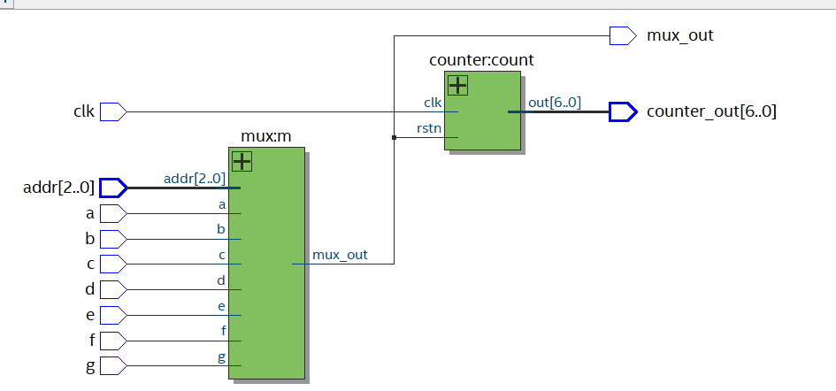
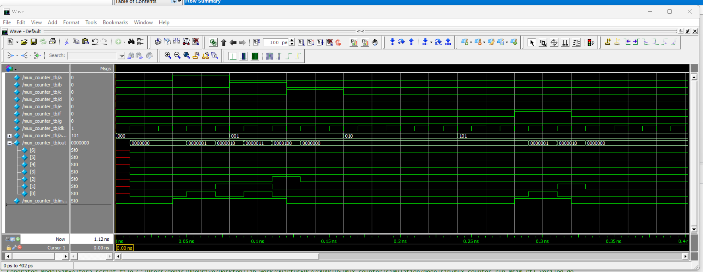

# Synethis
## Code
Схема представляет собой мультиплексор последовательно соединенный с счетчиком

'''verilog

    module mux_counter(a, b, c, d, e, f, g, addr, clk, mux_out, counter_out);
        input a,
                b,
                c,
                d,
                e,
                f,
                g,
                clk;
                
        input	[2:0] addr;

        output [6:0]counter_out;
        output mux_out;
        
        mux m(a,b,c,d,e,f,g,addr,mux_out);
        counter count(.clk(clk), .rstn(mux_out), .out(counter_out));

    endmodule 

'''

Синтезированная схема:

## Tb

'''verilog

    module mux_counter_tb;
        reg a,
            b,
            c,
            d,
            e,
            f,
            g,
            clk;
            
        reg [2:0] addr;
        wire [6:0] out;
        wire mux_out;
        
        mux_counter mc(a,b,c,d,e,f,g, addr,clk, mux_out,out);
        
        always #10 clk = ~clk;
        initial begin
            {clk, b, c, d, e, f, g} <= 0;
            //{out[0],out[1],out[2],out[3], out[4],out[5], out[6]} <= 0;
            a <= 0;
            addr <= 0;
            #40;
            a<=1;
            
            #40; 
            
        
            //$monitor("%d  --->  %b %b %b %b %b %b %b %b %b",$time, a, b, c, d, e, f, g, addr);

            a <= out[0];
            b <= out[1];
            c <= out[2];
            d <= out[3];
            e <= out[4];
            f <= out[5];
            g <= out[6];
            addr <= 1;
        
            #40;
            a <= out[0];
            b <= out[1];
            c <= out[2];
            d <= out[3];
            e <= out[4];
            f <= out[5];
            g <= out[6];
            b <= 0;
            

            #40;
            a <= out[0];
            b <= out[1];
            c <= out[2];
            d <= out[3];
            e <= out[4];
            f <= out[5];
            g <= out[6];
            addr <= 2;

            #40;
            a <= out[0];
            b <= out[1];
            c <= out[2];
            d <= out[3];
            e <= out[4];
            f <= out[5];
            g <= out[6];
            c <= 0;
            
            #40;
            a <= out[0];
            b <= out[1];
            c <= out[2];
            d <= out[3];
            e <= out[4];
            f <= out[5];
            g <= out[6];
            addr <= 5;
            #40;
            f <= 1;
            #40;
            f <= 0;

            #800 $finish;
        end
    endmodule 

'''

Результурующие импульсы показывает правильность реализации мультиплексора
