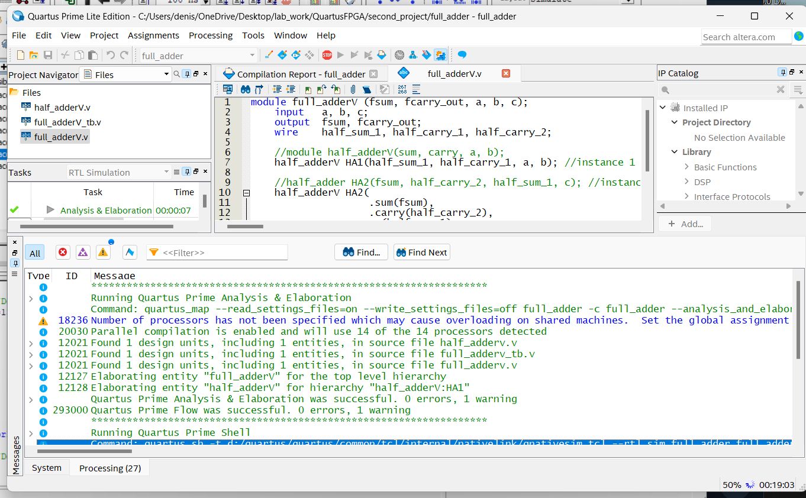
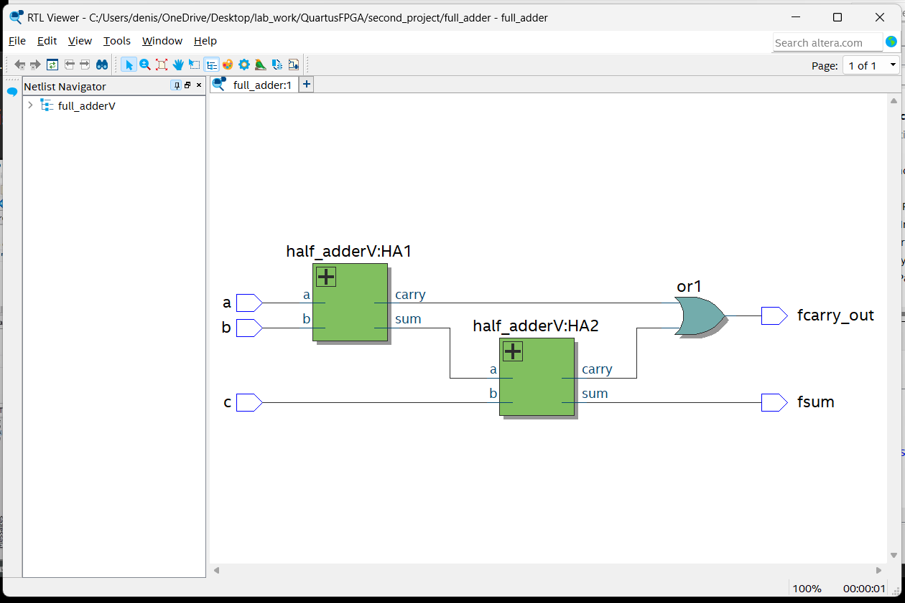
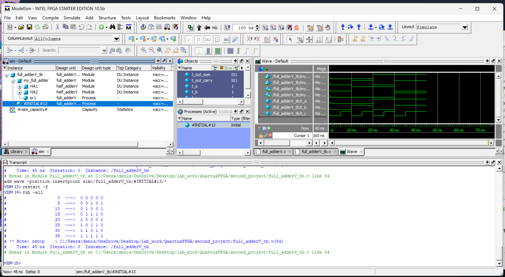

# Сумматор
## Синтез

По туториалу были установлены файлы: `half_adderV.v`, `full_adderV.v`, `full_adderV_tb.v`  
С их помощью был успешно проведен синтез сумматора:

## Симуляция

Сумматор работает корректно