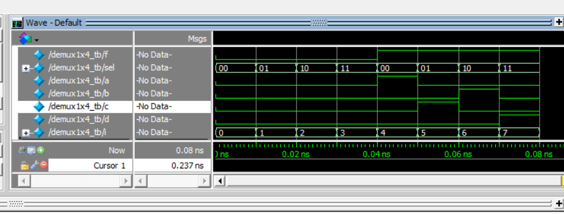

# Combo
## Combo code
'''verilog

    module combo (input a, b, c, d, e, output reg z);

        always @ (a or b or c or d or e) begin
            z = ((a & b) | (c ^ d) & ~e);
        end

    endmodule

'''
## Combo tb
'''verilog

	module combo_tb;   
		reg a, b, c, d, e;   
		wire z;   
		integer i;    
		combo u0 ( a, b, c, d, e, z);  
		initial begin  

			a <= 0;
			b <= 0;
			c <= 0;
			d <= 0;
			e <= 0;

			for (i = 0; i < 32; i = i + 1) begin
				{a, b, c, d, e} = i;
				#10;
			end
		#5 $finish;
	end
	endmodule

'''

# Half adder

## Half adder code

'''verilog

	module half_adder(input a,b, output reg sum, count);    
		always @ (a or b) begin    
			{count, sum} = a + b;    
		end   
	endmodule  

'''  
# Half adder tb

'''verilog

    module half_adder_tb;    
        reg a, b;   
        wire sum, cout;    
        integer i;     
        half_adder ha(a, b, sum, cout);    
        initial begin       
        a <= 0;    
        b <= 0;   
        $monitor("a=%0b b=%0b sum=%0b cout=%0b", a, b, sum, cout);    
        for (i = 0; i < 4; i = i + 1)     
        begin    
            {a, b} = i;     
            #10;    
        end    
        end    
    endmodule   

'''

# Full adder
## Full adder code

'''verilog

	module full_adder( input a, b, cin, output reg sum, cout);   
		always @ (a or b or cin) begin    
			{cout, sum} = a + b + cin;     
		end    
	endmodule    

'''

## Full adder tb

'''verilog

	module full_adder_tb;   
		reg a, b, cin;   
		wire sum, cout;   
		integer i;     
		full_adder fa ( a, b, cin, sum, cout);     
		initial begin   
			a <= 0;    
			b <= 0;     
			$monitor("a=%0b b=%0b cin=%0b cout=%0b sum=%0b", a, b, cin, cout, sum);     
			for (i = 0; i < 8; i = i + 1) begin    
				{a, b, cin} = i;    
				#10;     
			end    
		end    
	endmodule    

'''

# Demultiplexer 1x4

## Demultiplexer 1x4 code

'''verilog

    module demux1x4 ( input f, input [1:0] sel, output reg a, b, c, d);     
        always @ ( f or sel)     
        begin     
        a = f & ~sel[1] & ~sel[0];     
        b = f & sel[1] & ~sel[0];     
        c = f & ~sel[1] & sel[0];     
        d = f & sel[1] & sel[0];     
        end     
    endmodule    

'''

## Demultiplexer 1x4 tb

'''verilog

    module demux1x4_tb;   
        reg f;    
        reg [1:0] sel;    
        wire a, b, c, d;    
        integer i;     
        demux1x4 mux (f, sel, a, b, c, d);     
        initial    
        begin    
        f <= 0;    
        sel <= 0;    
        $monitor("f=%0b sel=%0b a=%0b b=%0b c=%0b d=%0b", f, sel, a, b, c, d);    
        for (i = 0; i < 8; i = i + 1)     
        begin     
            {f, sel} = i;    
            #10;    
        end    
        end    
    endmodule   

'''

# 2x1 multiplexer
## 2x1 multiplexer

'''verilog

    module mux2x1 (input a, b, sel, output reg c);    
        always @ ( a or b or sel)      
        begin    
        c = sel ? a : b;     
        end    
    endmodule   

'''

## 2x1 multiplexer

'''verilog

    module mux2x1_tb;    
        reg a, b, sel;    
        wire c;    
        integer i;    
        mux2x1 mux ( a, b, sel, c);    
        initial    
        begin    
        $dumpfile("build/mux21_tb.vcd");    
        $dumpvars;    
        a <= 0;    
        b <= 0;    
        sel <= 0;    
        $monitor("a=%0b b=%0b sel=%0b c=%0b", a, b, sel, c);   
        for (i = 0; i < 6; i = i + 1)    
        begin   
            {a, b, sel} = i;    
            #10;    
        end    
        end    
    endmodule    

'''

# JK flip flop
## JK flip flop code

'''verilog

    module flip_flop ( input j,    
                            input k,    
                            input rstn,    
                            input clk,    
                            output reg q);     
    always @ (posedge clk or negedge rstn)    
    begin    
        if (!rstn)     
        begin     
        q <= 0;     
        end    
        else    
        begin    
        q <= (j & ~q) | (~k & q);    
        end    
    end     
    endmodule    

'''

## JK flip flop tb

'''

	module flip_flop_tb;     
		reg j, k, rstn, clk;     
		wire q;     
		integer i;     
		reg [2:0] dly;     
		always #10 clk = ~clk;     
		flip_flop ff (j, k, clk, rstn, q);    
		initial begin    

			{j, k, rstn, clk} <= 0;    
			#10 rstn <= 1;     
			for (i = 0; i < 10; i = i+1) begin    
				dly = $random;    
				#(dly) j <= $random;    
				#(dly) k <= $random;    
			end    
			#20 $finish;    
		end    
	endmodule   

'''

# Mod 10 counter
## Mod 10 counter code

'''verilog

    module mod10_count ( input clk,     
                            input rstn,     
                            output reg[3:0] out);     

        always @ (posedge clk)     
        begin     
        if (!rstn)     
        begin     
            out <= 0;     
        end     
        else    
        begin    
            if (out == 10)     
            out <= 0;    
            else    
            out <= out + 1;    
        end   
        end    
    endmodule  

'''
## Mod 10 counter tb

'''

	module mod10_count_tb;    
		reg clk, rstn;    
		wire [3:0] out;    
		mod10_count u0 ( .clk(clk), .rstn(rstn), .out(out));    
		always #10 clk = ~clk;    
		initial begin    
			{clk, rstn} <= 0;    
			#10 rstn <= 1;    
			#450 $finish;    
		end    
	endmodule   

'''

# 4 bit left shift register
## 4 bit left shift register code

'''verilog

    module lshift4b(input d,   
                            input clk,   
                            input rstn,   
                            output reg [3:0] out);   
        always @ (posedge clk)   
        begin    
        if (!rstn)    
        begin    
            out <= 0;    
        end    
        else    
        begin    
            out <= {out[2:0], d};    
        end    
        end    
    endmodule    

'''

## 4 bit left shift register tb

'''verilog

    module lshift4b_tb;    
        reg clk, rstn, d;    
        wire [3:0] out;     
        integer i;    
        lshift4b lsh ( d, clk, rstn, out);     
        always #10 clk = ~clk;     
        initial    
        begin    
        {clk, rstn, d} <= 0;     
        #10 rstn <= 1;    
        for (i = 0; i < 20; i=i+1)    
        begin    
            @(posedge clk) d <= $random;    
        end    
        #10 $finish;    
        end    
    endmodule   

'''

# Result
All elements pass all tests, behave same as in examples